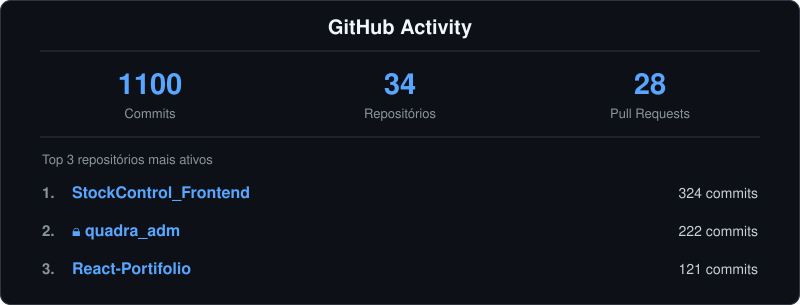

<h1 align="center">Olá! Sou o Pedro Lima 👋</h1>

<h3 align="center">Full Stack Developer</h3>

  Desenvolvedor FullStack, focado na criação de aplicações web, sistemas completos e APIs.

  🔭 Atualmente trabalho com desenvolvimento Full Stack 
  🌱 Estudando e aprimorando PHP, Next.js, TypeScript e Tailwind CSS 
  📫 <a href="mailto:pedromendeslima2016@gmail.com">pedromendeslima2016@gmail.com</a>

 

<h2 align="center">🛠️ Tecnologias</h2>

  

 

<h2 align="center">📊 GitHub Stats</h2>

  

 

<h2 align="center">🚀 Sobre meu GitHub</h2>

| | |
| :--- | :--- |
| 💻 **Foco** | Desenvolvimento Full Stack |
| ⚡ **Stack principal** | TypeScript • React • Next.js • Node.js |
| 🗄️ **Banco de dados** | MySQL • PostgreSQL |
| ☕ **Back-end** | Node.js • PHP • Java • Spring |
| 🎨 **Front-end** | React • Next.js • Tailwind CSS |

 

<h2 align="center">🌐 Contato</h2>

  
  
  

 

<h2 align="center">🐍 Minhas Contribuições</h2>

  

